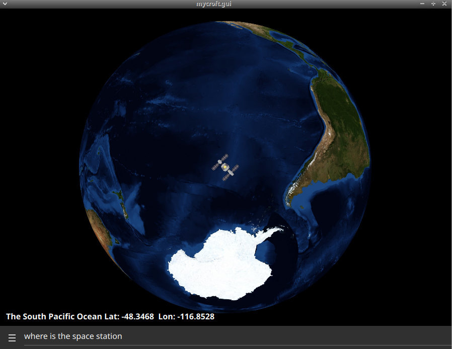
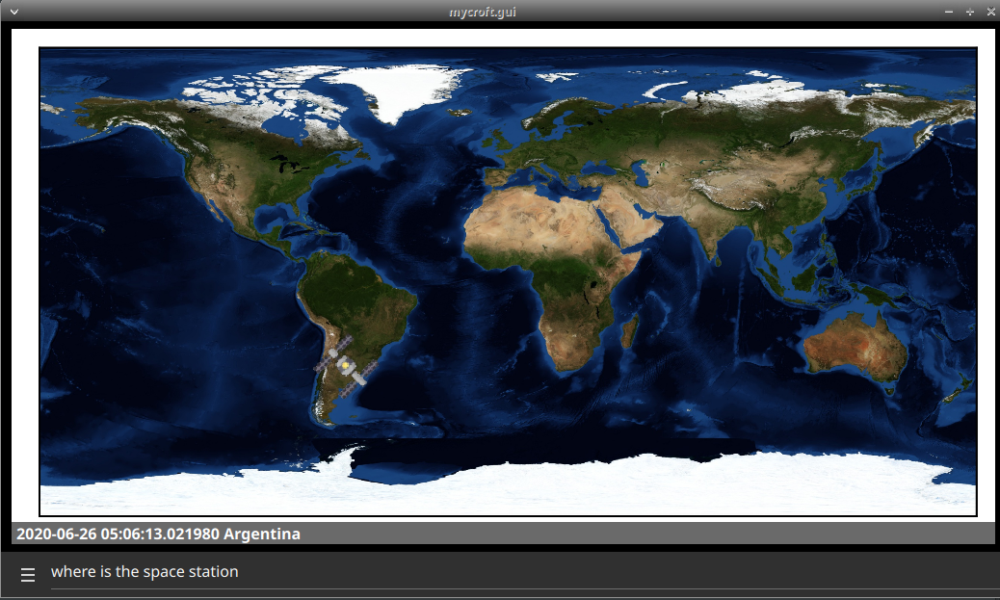
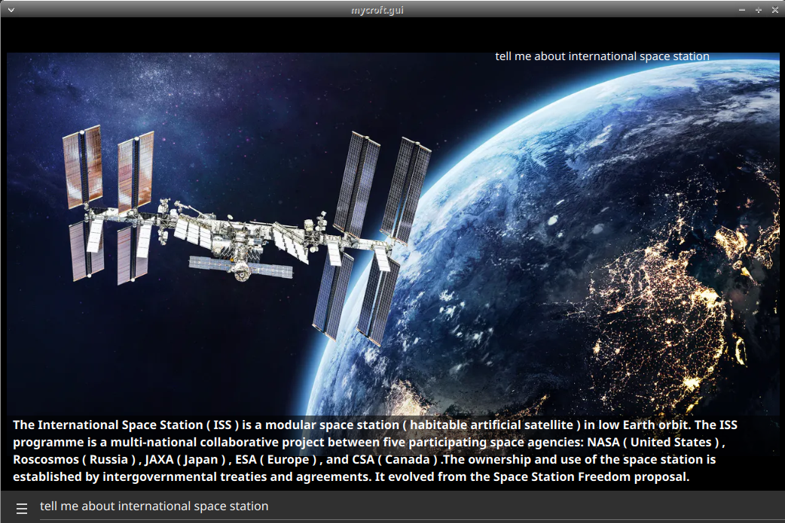

#  ISS Tracker

## About

Track the location of the ISS
  

Can be used as idle screen in a mark2

## Examples
* "Where is the ISS"
* "Who is on board of the space station"
* "When is the ISS passing over"
* "Tell me about the ISS"
* "how many persons on board of the space station"

## Credits
JarbasAl

## Category
**Information**

## Tags
#nasa
