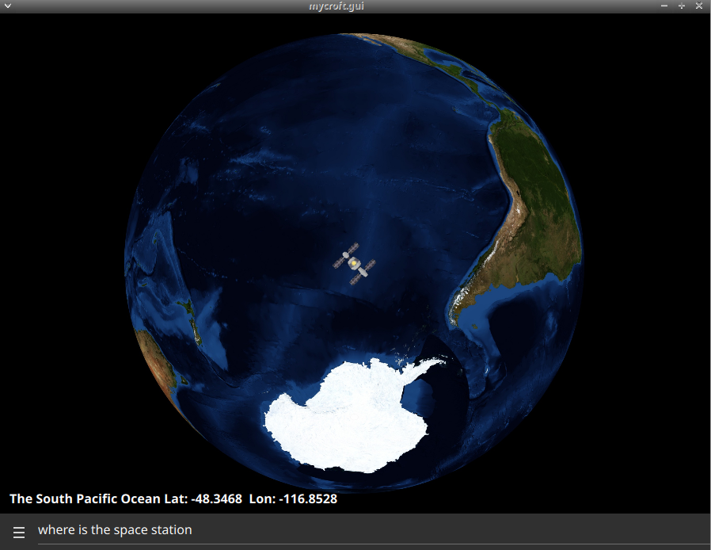
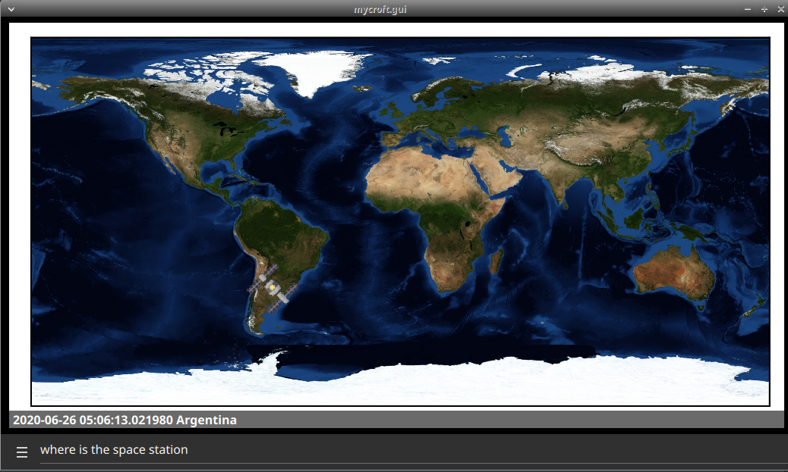
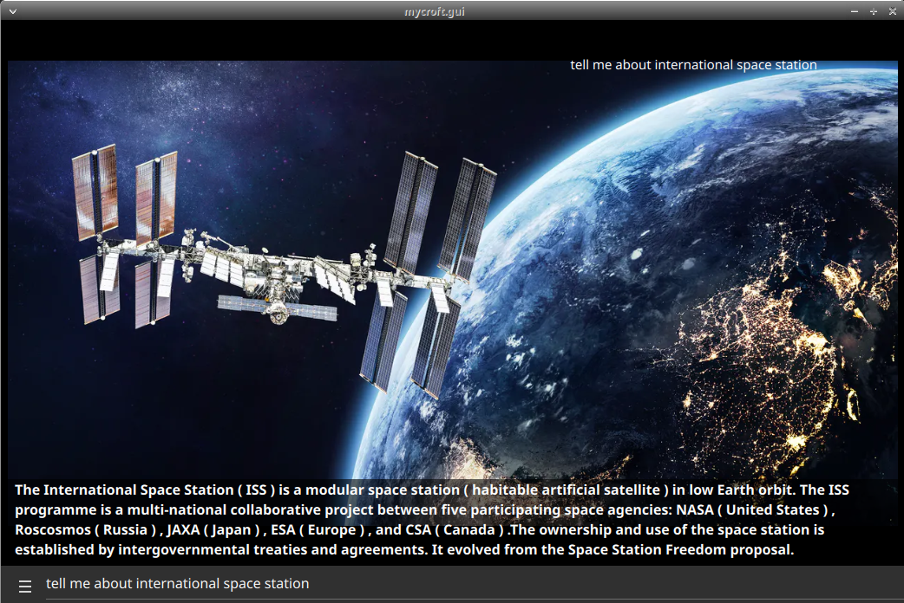

# ISS Tracker

## About

This OVOS skill reports the location of the International Space Station (ISS) and the astronauts on board. It can also run as an idle screen on a Mark 2 device.

## Examples

Say one of these phrases to the assistant.

* "Where is the ISS"
* "Who is on board of the space station"
* "When is the ISS passing over"
* "Tell me about the ISS"
* "How many persons on board of the space station"

## Related projects

* [OpenVoiceOS/OVOS-workshop](https://github.com/OpenVoiceOS/OVOS-workshop) — the skill framework this skill builds on.
* [OpenVoiceOS/ovos-core](https://github.com/OpenVoiceOS/ovos-core) — the assistant that loads and runs this skill.

## Credits

JarbasAl

## Category

**Information**

## Tags

#nasa
